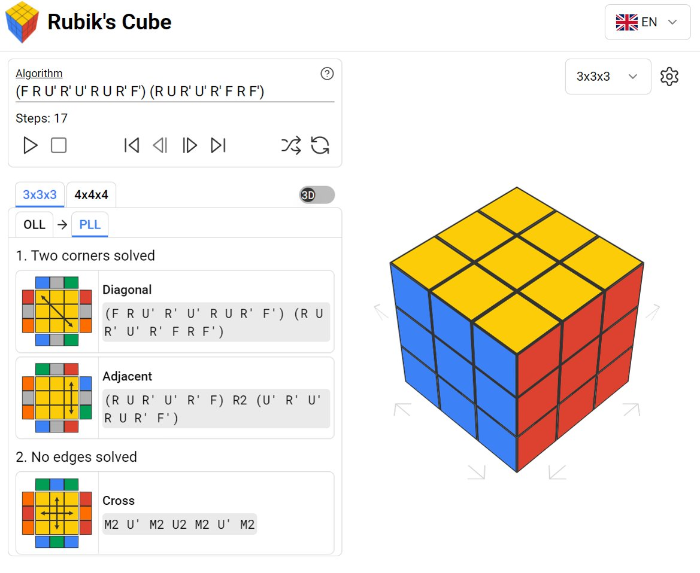

# rubiks-cube

A programmable rubiks cube written with Typescript, React and Redux.

[Try it now](https://seiichi-yahiro.github.io/rubiks-cube/)

## Notation

There are multiple ways to tell the cube how to rotate.

### Definition

-   sliceable letters: `L`, `R`, `U`, `D`, `F` and `B` (capital and non capital)
-   not sliceable letters: `M`, `E`, `S`, `X`, `Y` and `Z` (capital and non capital)
-   wide: `w` or `W`
-   prime: `'`
-   double: `2`

### Simple

Use a `sliceable` or `not sliceable` letter followed by optionally a `prime` and `double`.

Valid examples: `L` / `L'` / `L2` / `L'2`

### Complex

Use one or multiple `sliceable` letters followed by optionally `wide`, `prime` and `double`.
The cube axis slices are numbered starting with 1 which means that `2L` means "second axis slice from the left".
If you want to turn multiple slices you can use square brackets `[1,2]L` (turn slice 1 and to from the left)

Valid examples:

-   `2L`
-   `2L'` / `2L2` / `2L'2`
-   `2Lw`/ `2Lw'`/ `2Lw2` / `2Lw'2`
-   `[1,2,3]L` / `[1,2,3]L'` / `[1,2,3]L2` / `[1,2,3]L'2`

## How to build

run `yarn install`

then `yarn start` and go to localhost:3000

or `yarn run build:dev` / `yarn run build:prod` and open the `index.html` from the build folder
